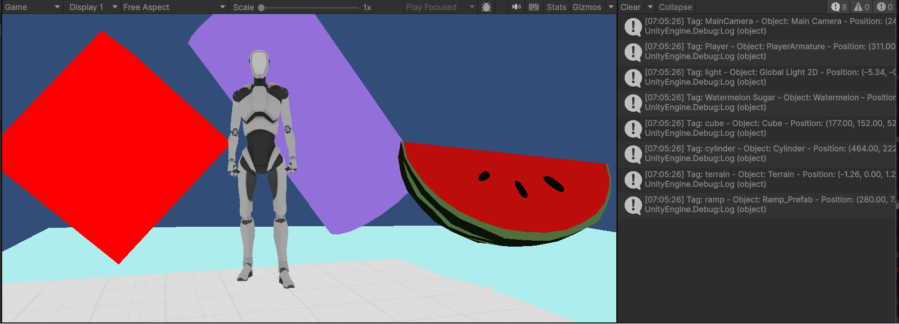

# Interfaces Inteligentes
## Lab 1 - Introducción a Unity

Para la práctica, he realizado una escena 3D básica, utilizando exclusivamente el editor de escenas, cumpliendo los siguientes requisitos de la configuración de la misma:

**1. Incluir objetos 3D básicos.** La escena incluye un cubo y un cilindro, ambos con cierto grado de rotación.

**2. Incluir en el proyecto el paquete *Starter Assets*.** Están tanto el de primera como el de tercera persona.

**3. Incluir un objeto libre de la Asset Store que no sea de los *Starter Assets*.** Al principio, intenté agregar un objeto de un paquete de animales, pero todos ellos daban error. Finalmente, me decanté por uno de comida, y agregué una sandía gigante a la escena.

**4. Crear un terreno.** El terreno está creado, y es visible en el *gif*, bajo la figura del *jugador* y demás objetos de la escena, pero tuve problemas intentando agregarle texturas.

**5. Cada objeto debe tener una etiqueta que lo identifique.** Están agregadas todas las etiquetas, como se muestra en la consola en el *gif* de la ejecución.

**6. Utilizar prefabs de *Starter Assets FPS* o *Third Person*.** He agregado a la escena un *jugador* en tercera persona, así como una rampa, del paquete de *Starter Assets Third Person*.

**7. Agregar un script que escriba en la consola la etiqueta y posición de cada objeto que hayas utilizado.** El script en cuestión se encuentra en este repositorio para su comprobación, y los resultados son visibles en la consola en el *gif*, como mencionaba previamente.

A continuación, se muestra el *gif* con la prueba:

